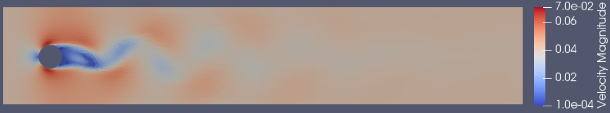
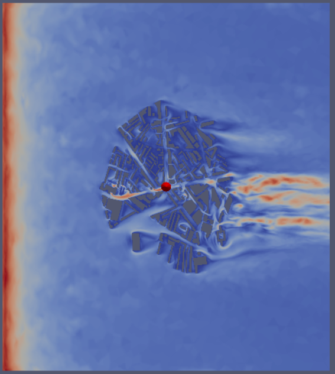

## Introduction
Reduced order modelling is a powerful technique for rapidly modelling high dimensional fluid dynamics systems.
Its speed could enable real-time decision making and operational modelling.





In this repository you can find the tools for reduced order modelling.

The follow test case are in this repository, including:
 - A 1D square wave prediction by LSTM (see: test_cases/square_wave/square_wave_lstm.py)
 - A 1D square wave training by DD-LSTM (see: test_cases/square_wave/square_wave_dd_lstm.py)
 - A 2D flow past a cylinder test case using LSTM (see: test_cases/LSTM_fpc)
 - A 2D flow past a cylinder test case using GPR (see: test_cases/GPR_fpc)
 - A 2D flow past a cylinder test case using DD-LSTM (see: test_cases/DD_LSTM_fpc)
 - A 2D flow past a cylinder test case using DD-LSTM (see: test_cases/DD_GPR_fpc)
 
The test case for 3D problem is too large to be here. To run that test case, you need to:
Install Putty (from: https://www.chiark.greenend.org.uk/~sgtatham/putty/latest.html)
Install Xming (from: https://netix.dl.sourceforge.net/project/xming/Xming/6.9.0.31/Xming-6-9-0-31-setup.exe)
Open Putty
Set host name as: ese-theos.ese.ic.ac.uk
Set Connection/SSH/X11, Enable X11 forwarding
Open Putty and login
Ask for account and password from e-mail: ys8718@ic.ac.uk
After logging in:
```bash
  cd /data/wade/test/Opal-master/tests/
  cd GPR_LSBU
   export PYTHONPATH='/data/wade/test/multifluids_icferst-master/python:$PYTHONPATH'
   export LD_LIBRARY_PATH=${LD_LIBRARY_PATH}:/data/wade/test/Opal-master/spud
   export PATH="/data/wade/test/Opal-master/spud:$PATH"
   diamond -s ../../schemas/opal.rng lsbu_gpr.opal
```
After editing the settings (or just use default)
```bash
   python2 ../../opal.py lsbu_gpr.opal
```
Finish running, see the visualization of result
```bash
   paraview
```
Open the nirom_replication.vtu and change the field from solid color to velocity.

 
## System requirement
Linux.

## Installation instructions
To download the repository to your local machine.
```bash
  git clone https://github.com/msc-acse/acse-9-independent-research-project-Wade003.git
```
Installing all packages below.
```bash
   pip install -U numpy
   pip install sklearn 
   pip install keras
   pip install tensorflow
   pip install matplotlib
   pip install torch==1.2.0+cpu torchvision==0.4.0+cpu -f https://download.pytorch.org/whl/torch_stable.html
   pip install vtk
```
Adding environment path for Opal and IC-Ferst
```bash
   export PYTHONPATH='/data/wade/test/multifluids_icferst-master/python:$PYTHONPATH'
   export LD_LIBRARY_PATH=${LD_LIBRARY_PATH}:/data/wade/test/Opal-master/spud
   export PATH="/data/wade/test/Opal-master/spud:$PATH"
```

## Dependencies
 The external libraries:
 - python 2.7 (Recommand)
 - numpy >= 1.16.4
 - scipy >= 1.2.2
 - matplotlib >= 3.1.0
 - jupyter >= 1.0.0 (to run demo notebooks)
 - Sphinx >= 1.8.5 (to compile documentation)
 - Keras >= 2.2.4
 - scikit-learn >= 0.20.3
 - tensorflow >= 1.14.0   
 - torch >= 1.1.0    
 - torchvision >= 0.3.0
 - vtk >= 8.1.2
## Repository Information
* __animation__		- recorded animation video for several test case
* __images__		- report related images
* __software__		- contains Opal (which is the major software I developed) and IC-Ferst (support to run the Opal)
* __report__		- contains the final report, detailing this project's motivations, software design, analysis, and conclusions 
* __test_cases__		- 1D square wave and 2D flow past a cylinder test cases

## Instructions to run a test case
In the root directory of this repository
```bash 
   diamond -s ../software/Opal-master/schemas/opal.rng fpc_nirom.opal
```
The file name(fpc_nirom.opal) should be changed to the opal file's name in another test case. As for the configuration of 2D problem, I recommend to remain the same; if you do need you change it and still want to test a 2D test case, you can change the nPOD in field\_name(Velocity) in svd\_type in compression. But too many or two small POD number would affect the performance.

Another setting could be changed is to change the training method from LSTM to GPR. We using GPR, it needs further setting. The scaling bounds are 0 10. The constant value is 1. The constant bounds are 1e-3 1e3. The RBF length scale is 100. The RBF length scale bounds are 1e-2 1e2. Ctrl + s to save your settings.

Run the model:
```bash 
   python2 ../software/Opal-master/opal.py fpc_nirom.opal
```
Visualize the result:
```bash 
   paraview
```
Open the nirom_replication.vtu files, Click apply, and click a dropbox showing solid colour, switch that to velocity. Then click a button to go to the second snapshots, click the re-scale button so you can see the result in reasonable colour. Then you can click play button to see the whole animation. If you want to see the original data, go to snapshots and open that in paraview.

## Author and Course Information
__Author:__ Wade Song
__Github:__ Wade003
__CID:__ 01569843

This project is completed for Imperial College's MSc in Applied Computational Science and Engineering program,
as part of the final course module ACSE9. This project was completed under the supervision of Professor Christopher Pain. 
## License  
Licensed under the MIT [license](https://github.com/msc-acse/acse-9-independent-research-project-Wade003/blob/master/LICENSE)